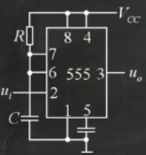

# 数字电子技术

### BCD 编码

用四位二进制码表示一位十进制位

### 逻辑运算

|  名称 |                               |
| :-: | ----------------------------- |
|  与  | $$F=A\cdot B$$                |
|  或  | $$F=A+B$$                     |
|  非  | $$F=\overline{A}$$           |
|  异或 | $$F=A\oplus B$$              |
|  同或 | $$F = A \odot B$$            |
|  与非 | $$F = \overline{A \cdot B}$$ |
|  或非 | $$F = \overline{A+B}$$       |

### 三态门

三态门的输出有三个状态，分别为高电平、低电平和高阻态

### 集电极开路门

也称 OC 门

### TTL 电路

输入电压小于 0.4 V 时，相当于接入低电平。输入电压大于 2.4V 时，相当于接入高电平。

输入端接下拉电阻，阻值小于$$0.7K\Omega$$ 时，相当于接入低电平，其余相当于接入高电平。

悬空相当于接入高电平。

### CMOS 电路

高电平接近电源电压，低电平接近 0 V。

不允许悬空

### 反演规则

1. 与项加括号
2. 反演，输入取反、与或取反，长非号不动

### 对偶规则

1. 与项加括号
2. 对偶，输入不动、与或取反，长非号不动

### 与非-与非形式

形如

$$
\overline{\overline{AB}\cdot\overline{CD}}
$$

的形式。

一般逻辑函数化为与非-与非形式：

1. 化为与或式
2. 加入两个长非号
3. 利用反演规则化简

### 最小项

最小项是一个包含所有输入的与项，所有项和为 1。

### 卡诺图

可用于化简逻辑函数，或通过真值表反推逻辑表达式。

通过最小项或真值表填写卡诺图。

#### （一）三变量卡诺图

| 0 | 2 | 6 | 4 |
| - | - | - | - |
| 1 | 3 | 7 | 5 |

#### （二）四变量卡诺图

| 0 | 4 | 12 | 8  |
| - | - | -- | -- |
| 1 | 5 | 13 | 9  |
| 3 | 7 | 15 | 11 |
| 2 | 6 | 14 | 10 |

### 逻辑相邻

若两个最小项逻辑相邻，则两者仅有一个变量不同。

### 卡诺圈

### 全加器

有三个输入，包含来自低位的进位。

### 半加器

有两个输入。

### 竞争冒险

组合逻辑电路的竞争冒险现象是由于电路中存在延时引起的。

当卡诺圈存在相切时，就存在竞争冒险。

### 译码器

将二进制数转化为十进制数

### 编码器

将十进制数转化为二进制数

#### （一）优先编码器

允许多个输入端同时为有效

### 数据选择器

### 上升沿与下降沿

上升沿：低电平转化为高电平

下降沿：高电平转化为低电平

### 触发器

触发器的输出是由当前状态和当前输入决定的。

|   类型   |       解释      |                      状态方程                      |                    约束条件                   |
| :----: | :-----------: | :--------------------------------------------: | :---------------------------------------: |
| RS 触发器 | R:RESET/S:SET |       $$Q^{n + 1} = \overline{S} + RQ$$       | $$R+S=1$$或$$\overline{R}\overline{S}=0$$ |
|  D 触发器 |     D:DATA    |               $$Q^{n + 1} = D$$               |                                           |
| JK 触发器 | J:JEEP/K:KEEP | $$Q^{n + 1} = J\overline{Q} + \overline{K}Q$$ |                                           |
|  T 触发器 |               | $$Q^{n + 1} = T\overline{Q} + \overline{T}Q$$ |                                           |

### 激励方程

输入到触发器的方程

### Moore 型电路

输出与输入无关，状态转移真值表即为状态转移表。

### Mealy 型电路

输出和输入有关

### 状态转移图

状态转移图中环的大小即为其作为计数器的进制。

#### （一）自启动特性

当状态转移图中只存在一个环时，存在自启动特性。

### 集成计数器

利用集成计数器设计的计数器都具有自启动功能。

#### （一） 4 位同步二进制计数器 74161

|   功能   | 实现条件                                                               | 说明      |
| :----: | ------------------------------------------------------------------ | ------- |
| 加 1 计数 | $$P=T=1, \overline{CLR} = \overline{LD} = 1, CLK = \uparrow$$     | 输出加 1   |
|  同步预置  | $$P=T=1, \overline{CLR} = 1,  \overline{LD} = 0, CLK = \uparrow$$ | 输出赋值为输入 |
|  异步清零  | $$\overline{CLR} = 0$$                                            | 输出变为 0  |
|  计数保持  | $$P=0, T=1, \overline{CLR} = \overline{LD} = 1$$                  | 输出不变    |

同步预置法

异步清零法

#### （二）同步十进制计数器 74160

#### （三）4 为同步二进制计数器 74163

### 移位寄存器

每经过一个时钟脉冲移位一次，移出的数据删除，缺位的数据补上串行输入的数据。

### 半导体存储器

### 555 定时器

设电源电压为 $$V_{CC}$$。

#### （一）施密特触发器

.png>)

可以把不规则的信号整形成比较规则的数字脉冲信号。

上触发电压$$V_{T+} = \frac{2}{3} V_{CC}$$，下触发电压$$V_{T-} = \frac{1}{3} V_{CC}$$。

输入电压上升时与 $$V_{T+}$$的交点处，输出电压由高变低；

输入电压下降时与 $$V_{T-}$$的交点处，输出电压由低变高；

#### （二）单稳态触发器

大于 $$\frac{1}{3}V_{CC}$$为高电平。

低电平为稳态，高电平为暂稳态。

暂稳态持续时间 $$T_w = 1.1 \cdot RC$$。

#### （三）多谐振荡器

.png>)

电容充电时，电容 C 两端电压逐渐增大，输出高电平。

电容放电时，电容 C 两端电压逐渐减小，输出低电平。

持续时间 $$T = 0.7C\sum R$$

震荡周期为高电平持续时间加低电平持续时间。

### 可编程逻辑器件（PLD)

用 PLD 进行逻辑设计时，应将逻辑函数表达式变换成最简与或式。

### A/D 转换器

A/D 转换器的过程可分为采样、保持、量化、编码四个步骤。

转换器中能分辨输入模拟信号的最小量称为分辨率。

分辨率等于量程除以 $$2^n$$（n 为 A/D 转换器位数）

A/D 转换器的输入与输出的关系可表示为：

$$
y = \frac{2^n - 1}{V_{REF}} x
$$

其中 $$V_{REF}$$为参考电压，$$n$$为位数。

### D/A 转换器

D/A 转换器的输入与输出的关系可表示为：

$$
V_0 = \frac{D - 1}{2^n} V_{REF}
$$

其中 D 为输入。
